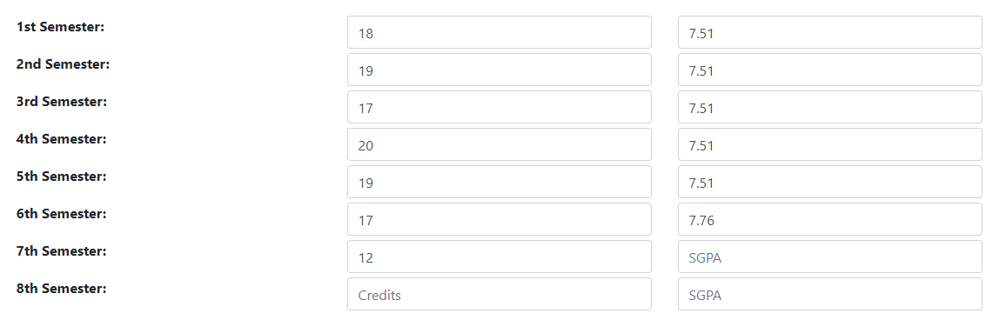

# CGPA-Calculator :scroll:

:computer: A simple CGPA Calculator/Predictor app  
:link: Link to the hosted app => [https://jai-dewani.github.io/cgpa-calculator/](https://jai-dewani.github.io/cgpa-calculator/)

> I haven't added the credits for other batches and branches because I don't have that information with me, maybe someone could add a pull request after updating this.  

## How to use :question:
- To calculate you current CGPA enter the credits of each semester and the SGPA of respectice semester
- You can use the credits (if) provided in the websitem, __Just click copy to place them in the Credits input columnn__ 
- It will only consider the entries which have both the Credits and SGPA filled out

## If you remember the CGPA till x-th semester and the SGPA of subsequent semesters, this should work :point_down:
- Enter the credits of each semester as usual
- Assuming you know the CGPA till xth semester, Enter the CGPA inplace of SGPA till xth semester
- Enter your SGPA in every other semester
- And this should basically work! :tada:

### Here is an example of the above steps  

